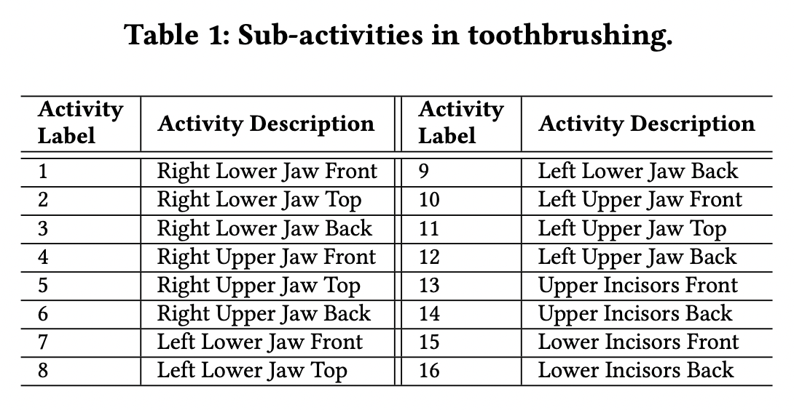
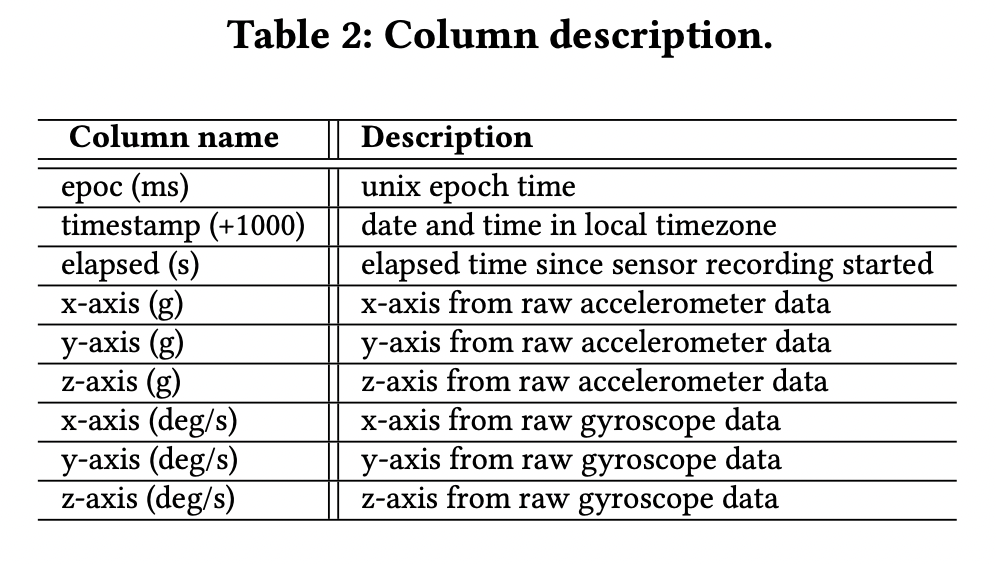

# Lab06 - Artigo de Dataset Público

Estrutura de pastas:

~~~
├── README.md  <- arquivo apresentando a tarefa
│
└── images     <- arquivos de imagem usados na tarefa (se houver)
~~~

# Aluno
* `RA`: `Gabriel Dourado Seabra`

# Análise do Artigo `Dataset: Toothbrushing Data and Analysis of its Potential Use in Human Activity Recognition Applications`

| campo | valor |
|------------|----------------------------------------|
| referência | `HUSSAIN, Zawar et al. Toothbrushing data and analysis of its potential use in human activity recognition applications: dataset. In: Proceedings of the Third Workshop on Data: Acquisition To Analysis. 2020. p. 31-34.` |
| link       | `https://dl.acm.org/doi/pdf/10.1145/3419016.3431489` |
| dataset | `https://zenodo.org/record/4118900#.YVa3xxDMI-Q` |
| formato | `CSV` |

## Resumo

> O artigo descreve o processo de obtenção e organização de uma base de dados de séries temporais de múltiplas sessões de escovação de dentes de 17 participantes ao longo de uma semana, assim como alguns experimentos realizados nessa base. Nessas sessões, os participantes foram observados e requisitados para realizar 16 atividades, cada uma referente à escovação de uma região diferente (grupos diferentes de dentes) conforme a Tabela 1. Com sensores nas escovas (acelerômetro e giroscópio),  que podiam ser manuais ou elétricas, obtiveram a aceleração da escova e as variações nos ângulos em cada eixo (XYZ) ao longo do tempo durante cada atividade (Tabela 2). Com isso, conseguiram treinar um classificador SVM que identifica com 98,6% de acurácia qual região está sendo escovada dados os padrões observados pelos sensores.

## Perguntas de pesquisa/análises

> O dataset permite que sejam feitas pesquisas sobre quais regiões da boca estão sendo escovadas por uma população usando simples sensores nas escovas. Isso permitiria trazer insights sobre a qualidade da escovação de um indivíduo ou mesmo de um conjunto de indivíduos. Esses dados poderiam, em última análise, servir para entender a progressão ou frequência de cáries ou doenças dentárias em uma pessoa ou uma população.

## Trabalhos relacionados

> Com os dados coletados, os autores conseguiram treinar um classificador SVM que identifica com 98,6% de acurácia qual região está sendo escovada dados os padrões observados pelos sensores. Além disso, o artigo menciona algumas iniciativas de "Ubiquitous sensing" (sensoramento ubíquo) em diversas áreas na pesquisa de Reconhecimento de Atividade Humana (HAR), principalmente em aplicações na saúde. Esses sensores tem sido usados para monitorar atividades como
sono [Hussein et al. 2019], uso de medicamentos [Aldeer et al. 2019], entre outras atividades.